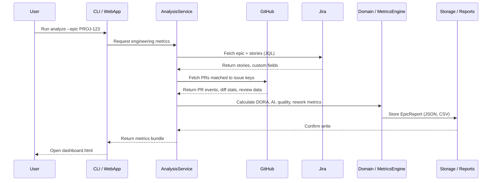

# Architecture Overview

EngMetrics AI is structured as a layered CLI application with a clean separation between domain logic, external integrations, and rendering. The same core can back a future web API, an AI agent, or a CI step with only a thin adapter layer.

---

## Guiding principles

- **The domain is pure and I/O-free.** Models, metric calculations, and risk scoring never call external services. This makes them testable in isolation and reusable by any future interface.
- **Integrations sit behind small Protocols.** Jira, GitHub, and quality sources are interchangeable; mock implementations follow the same interface as real ones.
- **One orchestration entry point.** `AnalysisService` is the single place that wires together integrations, domain calculations, and report rendering.

---

## Component map

```
src/ai_engineering_metrics/
├── cli.py              # Typer CLI — thin shell, no business logic
├── config.py           # Pydantic Settings: env vars / .env / user config YAML
├── service.py          # AnalysisService — orchestration entry point
│
├── domain/             # Pure, I/O-free
│   ├── models.py       # Shared Pydantic models (Epic, Story, PullRequest, …)
│   ├── metrics.py      # Productivity, AI-usage, rework, quality calculations
│   └── risk.py         # AI Dependency Risk Score (0–100, explainable)
│
├── integrations/       # External systems behind Protocol interfaces
│   ├── base.py         # Retry/rate-limit HTTP client + source Protocols
│   ├── jira_client.py  # Jira Cloud REST (JQL search, dev panel)
│   ├── github_client.py# GitHub via gh CLI (PR discovery + enrichment)
│   └── quality_client.py # JSON / null quality sources
│
├── reports/            # Jinja2 + Plotly dashboard rendering
├── mock/               # Synthetic data for --mock mode
└── storage/            # JSON serialisation / deserialisation

tests/                  # pytest; integration tests use mock implementations
```

---

## Data flow



---

## Intelligence lenses

The domain layer computes five independent lenses from the same raw data:

| Lens | Key outputs |
|---|---|
| **DORA metrics** | Lead Time, Deployment Frequency, Change Failure Rate, MTTR |
| **AI impact** | Hours saved, token cost, AI Dependency Risk Score |
| **Code quality** | Per-PR complexity proxy, code smells, test coverage heuristics |
| **Flow & rework** | Time to merge, review cycles, commits after review, reverts |
| **Risk intelligence** | Explainable 0–100 risk score blending all lenses |

---

## External integrations

| Integration | Transport | Auth |
|---|---|---|
| **Jira Cloud** | REST API v3 | API token (stored in user config or `.env`) |
| **GitHub** | `gh` CLI (subprocess) | `gh auth login` once; no token in this tool |
| **Quality source** | JSON file or null adapter | File path in config (optional) |

All integrations return typed Pydantic models to the domain layer. No raw dicts cross the integration boundary.

---

## Configuration priority

```
CLI flags  >  environment variables  >  .env file  >  user config YAML  >  defaults
```

User config lives outside the repo (`~/.config/ai-engineering-metrics/config.yaml` on Linux/macOS, `%APPDATA%/…` on Windows) so it is shared across all projects and never committed.

---

## Extensibility strategy

The project is designed for three future extension points:

1. **New data source** — implement the `IssueSource` or `PRSource` Protocol in `integrations/` and register it in `AnalysisService`. No domain changes needed.
2. **New metric or lens** — add a pure function to `domain/metrics.py`, extend the `EpicReport` model, and re-render.
3. **New output format** — add a renderer in `reports/` (e.g. Slack block kit, PDF). `AnalysisService` returns the `EpicReport`; the renderer is swappable.

A **plugin architecture** (community-contributed integrations, metrics, and renderers) is on the [roadmap](../ROADMAP.md).

---

## Architecture Decision Records

Significant architectural decisions are recorded as ADRs in [`docs/adr/`](adr/).

- [ADR-001 — Platform repositioning](adr/ADR-001-platform-repositioning.md)
